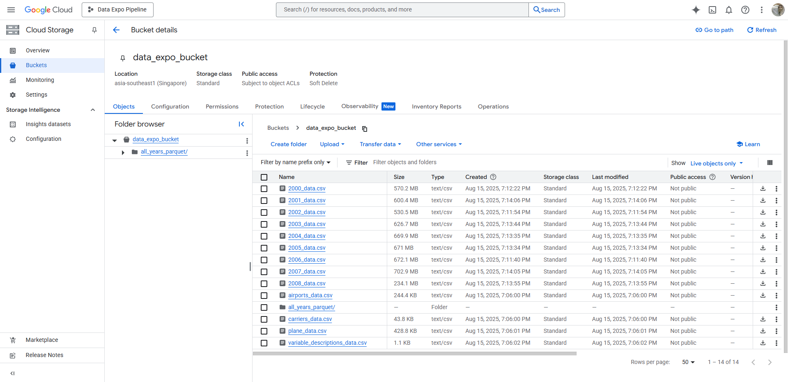
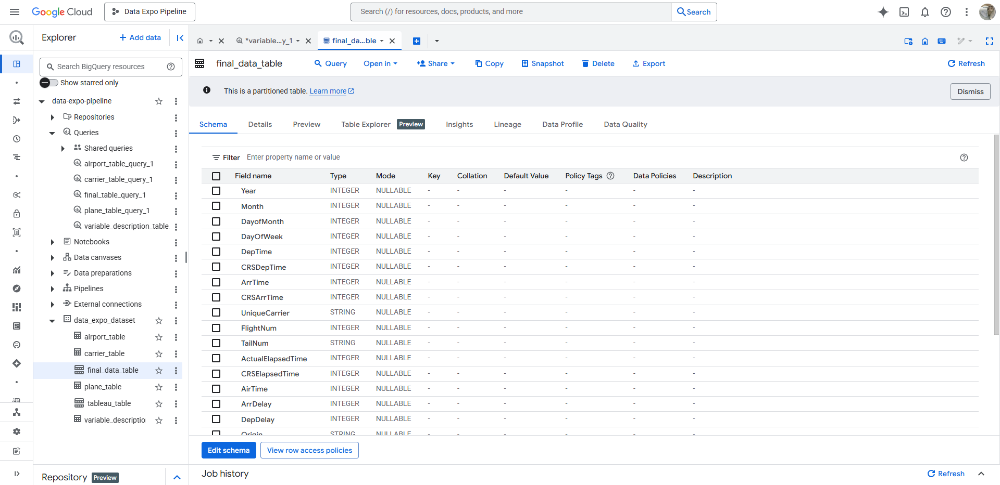
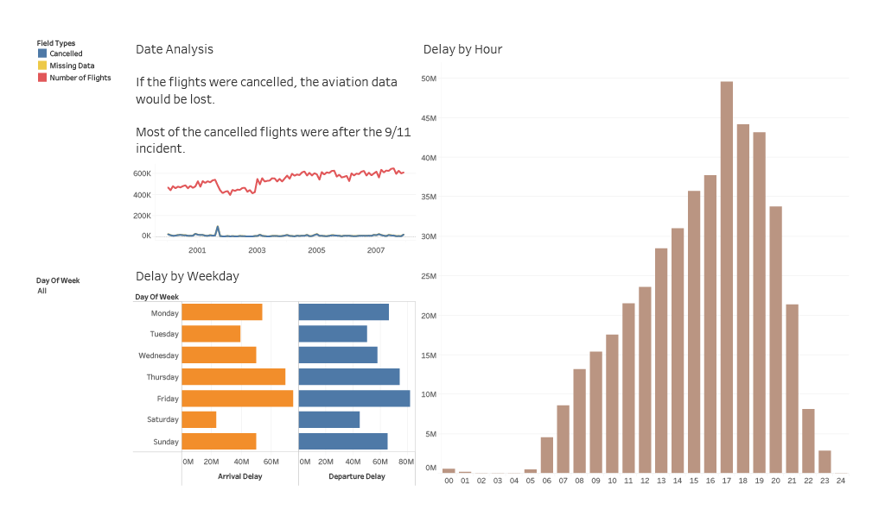

# Data-Expo-Pipeline

<a id="readme-top"></a>

## About this project

Data Expo Pipeline is an end-to-end data pipeline for the Data Exposition 2009 challenge. It demonstrates modern data engineering practices, including data ingestion through web crawling, orchestration with Apache Airflow, and scalable processing on the Google Cloud Platform.

Built with Docker for reproducibility, the pipeline is easy to deploy and extend. It ingests raw flight data, processes and transforms it, stores it in BigQuery, and finally powers interactive dashboards for analysis. While this project focuses on the 2009 dataset, it provides a reusable framework for large-scale analytics in domains such as transport, healthcare, or e-commerce.

Data Expo Pipeline is built using Ubuntu-24.04 on Windows Subsystem Linux

<p align="right"><a href="#readme-top">back to top</a></p>

## Technologies Used

Below are the technologies / frameworks used in this project. 

- **Python** 
- **Terraform**
- **Jupyter Notebook** 
- **Docker** 
- **Apache Spark** 
- **Apache Airflow**  
- **Google Cloud Platform** 
- **Tableau** 

<p align="right"><a href="#readme-top">back to top</a></p>

## Prerequisite

In order to run / replicate this project from the beginning, you need to have:
- A [Google Cloud Platform (GCP) account](https://console.cloud.google.com/).
- A [service account](https://console.cloud.google.com/iam-admin/serviceaccounts), with the service account key saved into your local machine as a JSON file. 
- Ensure that the service account has these permissions: 
	- Viewer
	- Editor
	- Storage Admin
	- Storage Object Admin
	- BigQuery Admin
	- Dataproc Administrator
- A project to start with.
- Miniconda3 installed. 
- Required libraries installed
```sh
pip install -r /path/to/requirements.txt
```

- Terraform installed
```sh
wget https://releases.hashicorp.com/terraform/1.12.2/terraform_1.12.2_linux_amd64.zip
unzip terraform_1.12.2_linux_amd64.zip
sudo mv terraform /usr/local/bin/
rm terraform_1.12.2_linux_amd64.zip
```

- Check Terraform version
```sh
terraform --version

Terraform v1.12.2
on linux_amd64
+ provider registry.terraform.io/hashicorp/google v5.6.0
```

- Docker is also required to run this project. Install Docker Desktop and read the instructions for Docker with WSL [here](https://docs.docker.com/desktop/features/wsl/)

<p align="right"><a href="#readme-top">back to top</a></p>

## Getting Started

1. Clone the repository
```sh
git clone https://github.com/github_username/repo_name.git
```

2. Modify Terraform variables in `main.tf`, `variables.tf` and `terraform.tfvars`
3. Use Terraform to create Google Cloud Storage (GCS) buckets and Google BigQuery datasets.
```sh
terraform init
terraform plan
terraform apply
```

4. In case you want to delete GCS buckets and BigQuery datasets:
```sh
terraform destroy
```

5. Either build/extend images from the Dockerfiles in `/jupyter`, `/spark` and `/airflow` like this:
```sh
docker build -f ./jupyter/Dockerfile -t jupyter_base_image:v1
docker build -f ./spark/Dockerfile -t spark_base_image:v1
docker build -f ./airflow/Dockerfile -t airflow_base_image:v1
```

or use my images on Docker Hub:
```yaml
services:
  spark-master:
    image: hnahtneyugn/spark_base_image:v1
    container_name: de-spark-master
    ...

  spark-worker:
    image: hnahtneyugn/spark_base_image:v1
    container_name: de-spark-worker
    ...

  jupyter:
    image: hnahtneyugn/jupyter_base_image:v1
    container_name: jupyter-for-spark
    ...
```

6. Set up environment variables in `.env` file, using `.env.example` as a template. Airflow image can be set there:
```
# .env
AIRFLOW_IMAGE_NAME=hnahtneyugn/airflow_base_image:v1
```

7. Start Docker
```sh
docker-compose up -d
```

8. Access containers:
- Jupyter Notebook in `localhost:8888`
- Spark Master in `localhost:9090`
- Spark Worker in `localhost:8081`
- Airflow in `localhost:8080`
- Spark UI in `localhost:4041`

9. From inside Jupyter Notebook or Airflow, you can run Python/Jupyter scripts or using Airflow DAGs to run the jobs.

<p align="right"><a href="#readme-top">back to top</a></p>

## Usage 

**Crawl data from the web, ingest data into GCS bucket:**



**Data after being processed with Apache Spark will be uploaded to a BigQuery dataset:**



**Visualize data using Tableau:**
[](./dashboards/Extra_Analysis_Dashboard.pdf)

<p align="right"><a href="#readme-top">back to top</a></p>

## Contributing

This is my first ever project, and since it is still flawed at some points, any contributions you make are **greatly appreciated**.

If you have a suggestion that would make this better, please fork the repo and create a pull request. You can also simply open an issue with the tag "enhancement". Don't forget to give the project a star! Thanks again!

1. Fork the Project
2. Create your Feature Branch (`git checkout -b feature/AmazingFeature`)
3. Commit your Changes (`git commit -m 'Add some AmazingFeature'`)
4. Push to the Branch (`git push origin feature/AmazingFeature`)
5. Open a Pull Request

<p align="right"><a href="#readme-top">back to top</a></p>

## License

Distributed under the MIT License.

<p align="right"><a href="#readme-top">back to top</a></p>

## Contact

Ta Nguyen Thanh: [](https://github.com/hnahtneyugn) [](https://www.facebook.com/godsendparanoia/) [](https://www.instagram.com/tngtwx_/) [](https://www.linkedin.com/in/tanguyenthanh/) [](mailto:tanguyenthanh1969@gmail.com)

Project Link: https://github.com/hnahtneyugn/Data-Expo-Pipeline

<p align="right"><a href="#readme-top">back to top</a></p>
